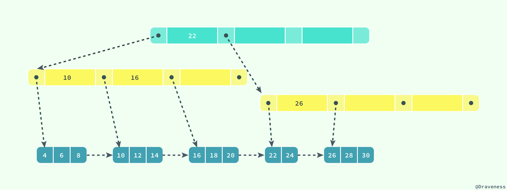
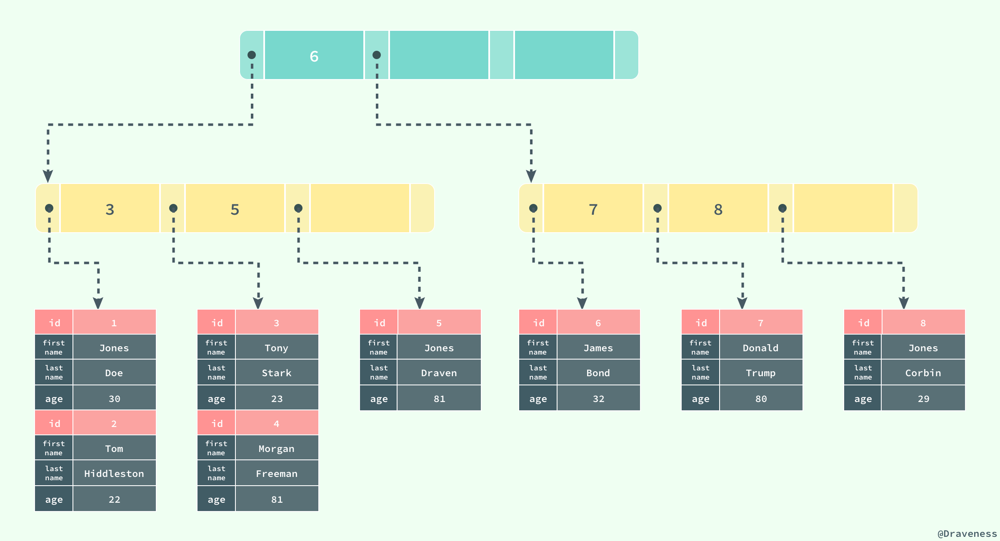
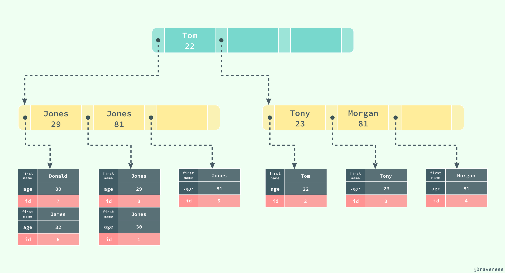
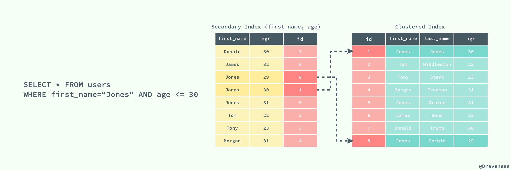

# InnoDB 索引

## 数据存储

当 InnoDB 存储数据时，它可以使用不同的行格式进行存储；MySQL 5.7 版本支持以下格式的行存储方式：


> `Antelope` 是 InnoDB 最开始支持的文件格式，它包含两种行格式 `Compact` 和 `Redundant` ，它最开始并没有名字； `Antelope` 的名字是在新的文件格式 `Barracuda` 出现后才起的， `Barracuda` 的出现引入了两种新的行格式 `Compressed` 和 `Dynamic` ；InnoDB 对于文件格式都会向前兼容，而官方文档中也对之后会出现的新文件格式预先定义好了名字：Cheetah、Dragon、Elk 等等。

两种行记录格式 `Compact` 和 `Redundant` 在磁盘上按照以下方式存储：


`Compact` 和 `Redundant` 格式最大的不同就是记录格式的第一个部分；在 `Compact` 中，行记录的第一部分倒序存放了一行数据中列的长度（Length），而 `Redundant` 中存的是每一列的偏移量（Offset），从总体上上看， `Compact` 行记录格式相比 `Redundant` 格式能够减少 `20%` 的存储空间。

### 行溢出数据

当 InnoDB 使用 `Compact` 或者 `Redundant` 格式存储极长的 `VARCHAR` 或者 `BLOB` 这类大对象时，我们并不会直接将所有的内容都存放在数据页节点中，而是将数据中的前 `768` 个字节存储在数据页中，后面会通过偏移量指向溢出页（off-page），最大768字节的作用是便于创建 **前缀索引**。溢出页（off-page）不存储在 B+tree 中，**使用的是uncompress BLOB page，并且每个字段的溢出都是存储独享**。


但是当我们使用新的行记录格式 `Compressed` 或者 `Dynamic` 时都只会在行记录中保存 `20` 个字节的指针，实际的数据都会存放在溢出页面中。


当然在实际存储中，可能会对不同长度的 TEXT 和 BLOB 列进行优化。

> 想要了解更多与 InnoDB 存储引擎中记录的数据格式的相关信息，可以阅读 [InnoDB Record Structure](https://dev.mysql.com/doc/internals/en/innodb-record-structure.html)

### 数据页结构

与现有的大多数存储引擎一样，InnoDB 使用页作为磁盘管理的最小单位；数据在 InnoDB 存储引擎中都是按行存储的，每个 `16KB` 大小的页中可以存放 `2-200` 行的记录。

页是 InnoDB 存储引擎管理数据的最小磁盘单位，而 `B-Tree` 节点就是实际存放表中数据的页面，我们在这里将要介绍页是如何组织和存储记录的；首先，一个 InnoDB 页有以下七个部分：


每一个页中包含了两对 `header/trailer`：内部的 `Page Header/Page Directory` 关心的是页的状态信息，而 `Fil Header/Fil Trailer` 关心的是记录页的头信息。

在页的头部和尾部之间就是用户记录和空闲空间了，每一个数据页中都包含 `Infimum` 和 `Supremum` 这两个虚拟的记录（可以理解为占位符）， `Infimum` 记录是比该页中任何主键值都要小的值， `Supremum` 是该页中的最大值：


`User Records` 就是整个页面中真正用于存放行记录的部分，而 `Free Space` 就是空余空间了，它是一个链表的数据结构，为了保证插入和删除的效率，整个页面并不会按照主键顺序对所有记录进行排序，它会自动从左侧向右寻找空白节点进行插入，行记录在物理存储上并不是按照顺序的，它们之间的顺序是由 `next_record` 这一指针控制的。

`B+` 树在查找对应的记录时，并不会直接从树中找出对应的行记录，它只能获取记录所在的页，将整个页加载到内存中，再通过 `Page Directory` 中存储的稀疏索引和 `n_owned、next_record` 属性取出对应的记录，不过因为这一操作是在内存中进行的，所以通常会忽略这部分查找的耗时。这样就存在一个命中率的问题，如果一个page中能够相对的存放足够多的行，那么命中率就会相对高一些，性能就会有提升。

B+树底层的叶子节点为一双向链表，因此 **每个页中至少应该有两行记录**，这就决定了 InnoDB 在存储一行数据的时候不能够超过 `8kb`，但事实上应该更小，因为还有一些 InnoDB 内部数据结构要存储。

通常我们认为 `blob` 这类的大对象的存储会把数据存放在 off-page，其实不然，**关键点还是要看一个 page 中到底能否存放两行数据，blob 可以完全存放在数据页中(单行长度没有超过 `8kb`)，而 `varchar` 类型的也有可能存放在溢出页中(单行长度超过 `8kb`，前 `768byte` 存放在数据页中)**。


## 索引

索引是数据库中非常非常重要的概念，它是存储引擎能够快速定位记录的秘密武器，对于提升数据库的性能、减轻数据库服务器的负担有着非常重要的作用；**索引优化是对查询性能优化的最有效手段**，它能够轻松地将查询的性能提高几个数量级。

InnoDB 存储引擎在绝大多数情况下使用 B+ 树建立索引，这是关系型数据库中查找最为常用和有效的索引，但是 **B+ 树索引并不能找到一个给定键对应的具体值，它只能找到数据行对应的页**，然后正如上一节所提到的，数据库把整个页读入到内存中，并在内存中查找具体的数据行。



B+ 树是平衡树，它查找任意节点所耗费的时间都是完全相同的，比较的次数就是 B+ 树的高度；

> `B+` 树的叶子节点存放所有指向关键字的指针，节点内部关键字记录和节点之间都根据关键字的大小排列。当顺序递增插入的时候，只有最后一个节点会在满掉的时候引起索引分裂，此时无需移动记录，只需创建一个新的节点即可。而当非递增插入的时候，会使得旧的节点分裂，还可能伴随移动记录，以便使得新数据能够插入其中。**一般建议使用一列顺序递增的 ID 来作为主键**，但不必是数据库的 `autoincrement` 字段，只要满足顺序增加即可，如 `twitter` 的 `snowflake` 即为顺序递增的 ID 生成器。

### B+ 树的高度

这里我们先假设 B+ 树高为2，即存在一个根节点和若干个叶子节点，那么这棵 B+ 树的存放总记录数为：根节点指针数\*单个叶子节点记录行数。这里假设一行记录的大小为1k，那么一个页上的能放 16 行数据。假设主键ID为 bigint 类型，长度为 8 字节，而指针大小在 InnoDB 源码中设置为 6 字节，这样一共14字节，那么可以算出一棵高度为 2 的 B+ 树，能存放 <katex>16 \times 1024\div 14\times 16=18720<katex> 条这样的数据记录。

根据同样的原理我们可以算出一个高度为3的B+树可以存放：<katex>1170\times 1170\times 16=21,902,400<katex> 条这样的记录。所以在 InnoDB 中 B+ 树高度一般为 1~3 层，它就能满足千万级的数据存储。

### 聚集索引

InnoDB 存储引擎中的表都是使用索引组织的，也就是按照键的顺序存放；聚集索引就是按照表中主键的顺序构建一颗 B+ 树，并在叶节点中存放表中的行记录数据。

> 如果没有定义主键，则会使用非空的 UNIQUE键 做主键 ; 如果没有非空的 UNIQUE键 ，则系统生成一个6字节的 `rowid` 做主键;

```
CREATE TABLE users(
    id INT NOT NULL,
    first_name VARCHAR(20) NOT NULL,
    last_name VARCHAR(20) NOT NULL,
    age INT NOT NULL,
    PRIMARY KEY(id),
    KEY(last_name, first_name, age)
    KEY(first_name)
);
```

如果使用上面的 SQL 在数据库中创建一张表，B+ 树就会使用 id 作为索引的键，并在叶子节点中存储一条记录中的所有信息。



> 图中对 B+ 树的描述与真实情况下 B+ 树中的数据结构有一些差别，不过这里想要表达的主要意思是：**聚集索引叶节点中保存的是整条行记录，而不是其中的一部分**。

聚集索引与表的物理存储方式有着非常密切的关系，所有正常的表应该 **有且仅有一个** 聚集索引（绝大多数情况下都是主键），表中的所有行记录数据都是按照 **聚集索引** 的顺序存放的。

当我们使用聚集索引对表中的数据进行检索时，可以直接获得聚集索引所对应的整条行记录数据所在的页，不需要进行第二次操作。

### 辅助索引

数据库将 **所有的非聚集索引都划分为辅助索引**，但是这个概念对我们理解辅助索引并没有什么帮助；辅助索引也是通过 B+ 树实现的，但是它的叶节点并不包含行记录的全部数据，仅包含索引中的所有键和一个用于查找对应行记录的『书签』，在 InnoDB 中这个书签就是当前记录的主键。

辅助索引的存在并不会影响聚集索引，因为聚集索引构成的 B+ 树是数据实际存储的形式，而辅助索引只用于加速数据的查找，所以一张表上往往有多个辅助索引以此来提升数据库的性能。

> 一张表一定包含一个聚集索引构成的 B+ 树以及若干辅助索引的构成的 B+ 树。



如果在表 `users` 中存在一个辅助索引 (`first_name, age`)，那么它构成的 B+ 树大致就是上图这样，按照 (first_name, age) 的字母顺序对表中的数据进行排序，当查找到主键时，再通过聚集索引获取到整条行记录。



上图展示了一个使用辅助索引查找一条表记录的过程：通过辅助索引查找到对应的主键，最后在聚集索引中使用主键获取对应的行记录，这也是通常情况下行记录的查找方式。

### 覆盖索引

聚簇索引这种实现方式使得按主键的搜索十分高效，但是辅助索引搜索需要检索两遍索引：首先检索辅助索引获得主键，然后用主键到主索引中检索获得记录，这种行为被称之为 **回表**。回表会导致查询时多次读取磁盘，为减少IO MySQL 在辅助索引上进行优化，将辅助索引作为 **覆盖索引**（Covering index）。在查询的时候，如果 `SELECT` 子句中的字段为主键、辅助索引的键则不进行回表。


## 索引失效

索引并不是时时都会生效的，比如以下几种情况，将导致索引失效：

  1. 如果条件中有 or，即使其中有条件带索引也不会使用。要想使用or，又想让索引生效，只能将 or 条件中的每个列都加上索引
  2. 对于多列索引，不是使用的最左匹配，则不会使用索引。
  3. 如果 mysql 估计使用全表扫描要比使用索引快，则不使用索引。例如，使用`<>`、`not in` 、`not` `exist`，对于这三种情况大多数情况下认为结果集很大，MySQL 就有可能不使用索引。


## 索引使用

  - (7) - SELECT   
  - (8) - DISTINCT <select_list>  
  - (1) - FROM <left_table>  
  - (3) - <join_type> JOIN <right_table>  
  - (2) - ON <join_condition>  
  - (4) - WHERE <where_condition>  
  - (5) - GROUP BY <group_by_list>  
  - (6) - HAVING <having_condition>  
  - (9) - ORDER BY <order_by_condition>  
  - (10) - LIMIT <limit_number>  

关于 SQL 语句的执行顺序，有三个值得我们注意的地方：

  - **FROM 才是 SQL 语句执行的第一步，并非 SELECT**。 数据库在执行 SQL 语句的第一步是将数据从硬盘加载到数据缓冲区中，以便对这些数据进行操作。
  - **SELECT 是在大部分语句执行了之后才执行的，严格的说是在 FROM 和 GROUP BY 之后执行的**。理解这一点是非常重要的，这就是你不能在 WHERE 中使用在 SELECT 中设定别名的字段作为判断条件的原因。
  - **无论在语法上还是在执行顺序上， UNION 总是排在在 ORDER BY 之前**。很多人认为每个 UNION 段都能使用 ORDER BY 排序，但是根据 SQL 语言标准和各个数据库 SQL 的执行差异来看，这并不是真的。尽管某些数据库允许 SQL 语句对子查询（subqueries）或者派生表（derived tables）进行排序，但是这并不说明这个排序在 UNION 操作过后仍保持排序后的顺序。

虽然SQL的逻辑查询是根据上述进行查询，但是数据库也许并不会完全按照逻辑查询处理的方式来进行查询。 MySQL 数据库有两个组件 `Parser`（分析SQL语句）和 `Optimizer`（优化）。

从官方手册上看，可以理解为， `MySQL` 采用了基于开销的优化器，以确定处理查询的最解方式，也就是说执行查询之前，都会先选择一条自以为最优的方案，然后执行这个方案来获取结果。在很多情况下， `MySQL` 能够计算最佳的可能查询计划，但在某些情况下， `MySQL` 没有关于数据的足够信息，或者是提供太多的相关数据信息，估测就不那么友好了。

存在索引的情况下，优化器优先使用条件用到索引且最优的方案。**当 SQL 条件有多个索引可以选择， MySQL 优化器将直接使用效率最高的索引执行**。
